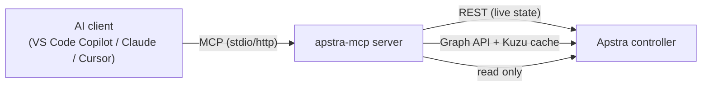

# 1. Introduction

> **Why read this first?** If you understand *what* the server is and *how* it talks to
> Apstra, every later step — configuration, transports, tool surfaces — will make sense
> instead of feeling like magic incantations.

## What problem does this solve?

Network engineers spend a lot of time asking Apstra the same questions: *Which devices
are down? What's blocking my commit? Why is this BGP session idle? What changed?*
Answering them means clicking through the Apstra UI or hand-writing REST calls.

**apstra-mcp** turns those questions into tools an AI assistant can call for you. You ask
in plain English — *"show me active anomalies on DC1 and what's blocking the commit"* —
and the assistant calls the right tools, reads live Apstra data, and explains the result.

## What is MCP?

The **Model Context Protocol (MCP)** is an open standard that lets an AI client (the
"host") talk to external "servers" that expose **tools**, **resources**, and **prompts**.
The client discovers the tools a server offers and calls them on your behalf during a
conversation.

This project is the **server**. You will install it, configure it with your Apstra
details, and connect a client to it.

## What this server exposes

`apstra-mcp` is built on **FastMCP 3.x** and ships a curated set of tools covering:

- **Blueprints & commit health** — list blueprints, surface commit-blocking build errors.
- **Anomalies** — current state plus a 30-day timeline with trends and correlation.
- **Topology & design intent** — systems, interfaces, links, BGP peerings, virtual
  networks, routing zones.
- **Device config** — rendered config, config context, and expected-vs-actual drift.
- **JunOS via Apstra** — run `show` commands through Apstra's fetch API; routing-policy
  diagnostics.
- **Telemetry & probes** — interface counters, utilisation, IBA probes, and trend stores.
- **Reference material** — the Apstra reference design guide and a JunOS command catalog.
- **Charts** — render PNG charts of trends for visual analysis.

You'll see the exact tool list in [Section 7](07-tools-reference.md).

## The read-only safety model

Every tool in this server **reads**. None of them push configuration, commit blueprints,
or change device state. The most "active" thing it does is run JunOS `show` commands
through Apstra's fetch API and clean up the temporary job afterwards. This makes it safe
to point at production for troubleshooting.

## How data flows (two paths)

Tools use one of three data paths, chosen by what they need:

| Path | Used for | Freshness |
|------|----------|-----------|
| **Live REST** | Operational state — anomalies, device health, counters | Real-time |
| **Graph cache (Kuzu)** | Design intent — topology, VNs, routing zones | Blueprint version |
| **Local SQLite stores** | Anomaly timeline & counter trends (populated by background pollers) | Rolling window |

The graph cache is built from Apstra's blueprint graph and rebuilt automatically when
Apstra reports a new blueprint version — which is why topology queries are fast after the
first call.

---

**Next:** [2. Prerequisites →](02-prerequisites.md)
