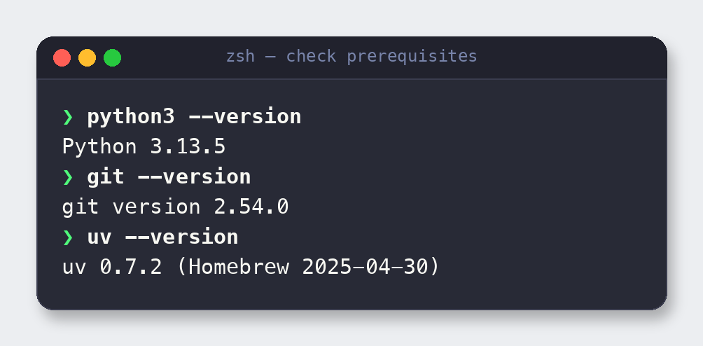

# 2. Prerequisites

> **Why this matters:** Two-thirds of "it won't install" problems are a Python that's too
> old. Ninety seconds of checking here saves an hour of debugging later.

## What you need

| Requirement | Minimum | How to check | Notes |
|-------------|---------|--------------|-------|
| **Python** | 3.10+ | `python3 --version` | The server declares `requires-python >=3.10`. 3.11 or 3.13 recommended. |
| **git** | any recent | `git --version` | To clone the repository. |
| **Apstra controller** | 4.x / 5.x | browser login | You need a reachable URL plus API-capable username and password. |
| **uv / uvx** | optional | `uvx --version` | Only needed for the zero-install "run from source" client mode. [Install uv](https://docs.astral.sh/uv/). |

## Check your environment

Run these three commands. All you need is a Python **3.10 or newer** and `git`:

> **Heads-up on the system Python:** On many macOS setups the default `python3` is an old
> 3.7/3.8 shipped by the OS or Xcode. If `python3 --version` shows anything below 3.10,
> install a newer one (for example with [Homebrew](https://brew.sh): `brew install python@3.13`)
> and use `python3.13` in the install commands, or create the virtual environment with the
> newer interpreter explicitly.

## What you do **not** need

- **No database to install** — the graph cache (Kuzu) and trend stores (SQLite) are
  embedded and created automatically.
- **No Apstra changes** — the server is read-only and needs only an API user.
- **No network access from this guide's captures** — everything shown here (install,
  setup, tests, server start) runs locally. Live Apstra calls only happen once you point
  it at a real controller.

---

**Next:** [3. Install the server →](03-install.md)
