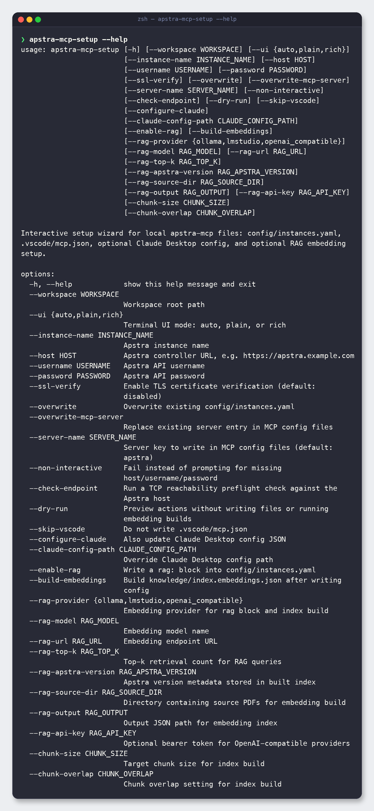
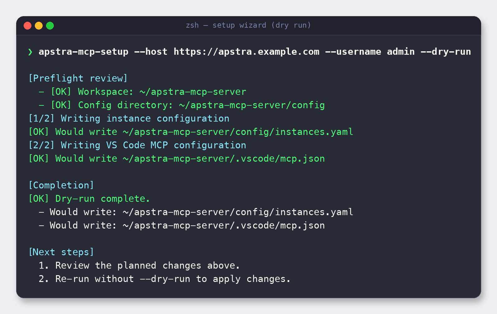
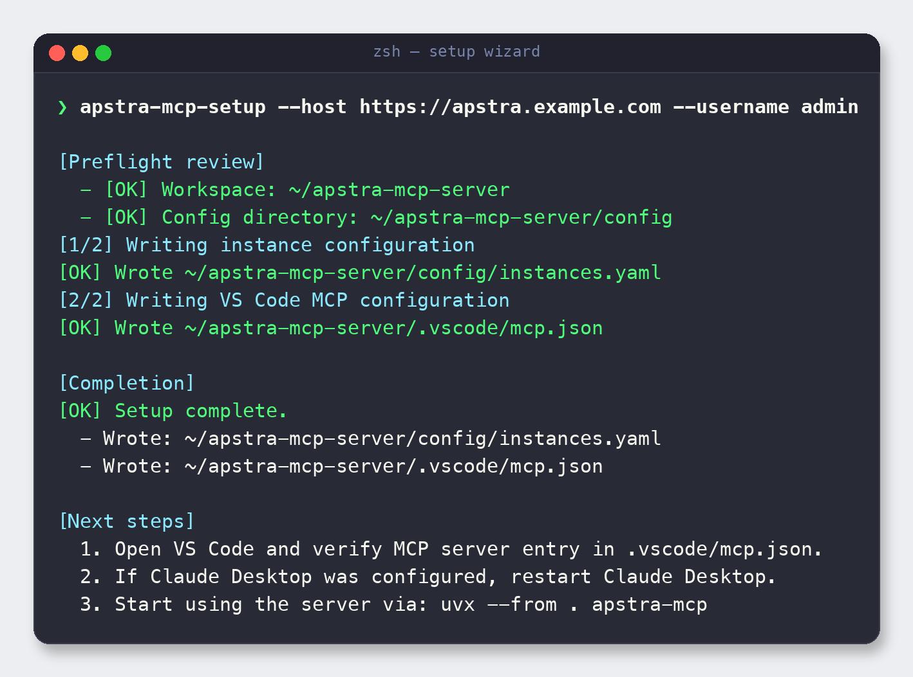
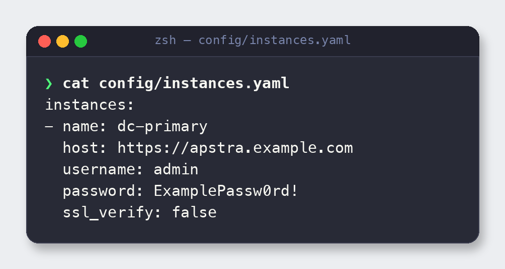
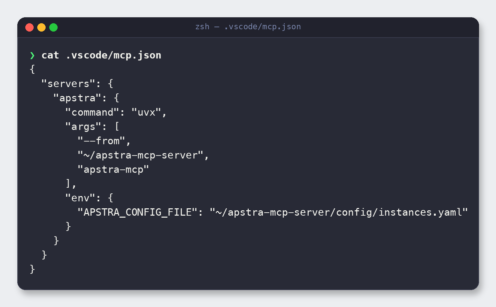

# 4. Configure with the setup wizard

> **Why a wizard?** The server needs to know *where* your Apstra controller is and *how*
> to authenticate. It also needs your MCP client to know how to launch it. The
> `apstra-mcp-setup` wizard writes both files correctly — with backups and a rollback
> script — so you don't hand-edit YAML and JSON and get the paths subtly wrong.

The wizard writes up to three things:

1. `config/instances.yaml` — your Apstra connection details.
2. `.vscode/mcp.json` — a VS Code MCP server entry that launches this server.
3. *(optional)* Claude Desktop config — the same entry for Claude.

---

## 4.1 See every option

Start by looking at what the wizard can do:

```bash
apstra-mcp-setup --help
```



Here is what each flag is for, grouped by purpose.

### Connection & workspace

| Flag | Purpose |
|------|---------|
| `--workspace WORKSPACE` | Root path to write files into (defaults to the current repo). |
| `--instance-name NAME` | Friendly name for this Apstra instance (default `apstra`). |
| `--host HOST` | Apstra controller URL, e.g. `https://apstra.example.com`. |
| `--username USERNAME` | Apstra API username. |
| `--password PASSWORD` | Apstra API password. Omit it to be prompted securely instead of putting it in your shell history. |
| `--ssl-verify` | Enable TLS certificate verification (default: **disabled**, for lab controllers with self-signed certs). |
| `--check-endpoint` | Run a TCP reachability preflight against the host before writing. |

### File-writing behaviour

| Flag | Purpose |
|------|---------|
| `--overwrite` | Overwrite an existing `config/instances.yaml`. |
| `--overwrite-mcp-server` | Replace an existing server entry in the MCP config files. |
| `--server-name NAME` | Key to write in the MCP config (default `apstra`). |
| `--skip-vscode` | Do **not** write `.vscode/mcp.json`. |
| `--dry-run` | Preview every action without writing anything. |
| `--non-interactive` | Fail instead of prompting for missing values (for scripts/CI). |
| `--ui {auto,plain,rich}` | Terminal UI style. `plain` is best for logs and screenshots. |

### MCP client targets

When run interactively, the wizard auto-detects installed MCP clients and offers to
configure each one it finds. You can also target them explicitly:

| Flag | Purpose |
|------|---------|
| `--configure-claude` | Also update the Claude Desktop config JSON. |
| `--claude-config-path PATH` | Override the Claude Desktop config location. |
| `--configure-cursor` | Also update Cursor's config (`~/.cursor/mcp.json`). |
| `--cursor-config-path PATH` | Override the Cursor config location. |
| `--configure-lmstudio` | Also update LM Studio's config (`~/.lmstudio/mcp.json`). |
| `--lmstudio-config-path PATH` | Override the LM Studio config location. |
| `--configure-antigravity` | Also update Antigravity's config (`~/.gemini/config/mcp_config.json`). |
| `--antigravity-config-path PATH` | Override the Antigravity config location. |

### RAG documentation search (optional)

| Flag | Purpose |
|------|---------|
| `--enable-rag` | Write a `rag:` block into `config/instances.yaml`. |
| `--build-embeddings` | Build `knowledge/index.embeddings.json` after writing config. |
| `--rag-provider {ollama,lmstudio,openai_compatible}` | Embedding backend. |
| `--rag-model`, `--rag-url`, `--rag-api-key` | Model name, endpoint URL, and optional bearer token. |
| `--rag-top-k` | How many chunks to retrieve per query. |
| `--rag-source-dir`, `--rag-output` | Source PDFs and output index path. |
| `--rag-apstra-version` | Apstra version metadata stored in the index. |
| `--chunk-size`, `--chunk-overlap` | Chunking parameters for the index build. |

RAG is covered end-to-end in the [Configuration reference](08-configuration-reference.md#83-rag-documentation-search).

---

## 4.2 Preview first with `--dry-run`

Before touching any files, do a dry run. It shows exactly what *would* be written and
where, without creating anything:

```bash
apstra-mcp-setup \
  --host https://apstra.example.com \
  --username admin \
  --password 'ExamplePassw0rd!' \
  --dry-run
```



This is the safe way to confirm the workspace path and file targets are what you expect.

> **Tip:** In real use, leave `--password` off entirely. The wizard will prompt for it
> without echoing it to your terminal or shell history.

---

## 4.3 Write the configuration

Happy with the preview? Run it for real. The wizard shows a preflight review, writes each
file, and prints next steps:

```bash
apstra-mcp-setup --host https://apstra.example.com --username admin
```



Notice what it did:

- **Preflight review** — confirmed the workspace and config directory.
- **[1/2]** wrote `config/instances.yaml`.
- **[2/2]** wrote `.vscode/mcp.json`.
- **Completion** — listed exactly what it wrote.
- **Next steps** — reminded you to verify the VS Code entry and (if used) restart Claude.

> **Backups & rollback:** If a target file already exists, the wizard backs it up as
> `*.bak.<timestamp>` before overwriting and generates a rollback script, so you can
> always get back to your previous state.

---

## 4.4 The generated files

### `config/instances.yaml`

Your Apstra connection details. With one instance it looks like this:



```yaml
instances:
  - name: dc-primary
    host: https://apstra.example.com
    username: admin
    password: ExamplePassw0rd!
    ssl_verify: false
```

**Multiple instances** are just more list entries — the tools accept an instance selector
so one server can serve several controllers:

```yaml
instances:
  - name: dc-primary
    host: https://apstra-1.example.com
    username: admin
    password: ExamplePassw0rd!
    ssl_verify: false
  - name: dc-secondary
    host: https://apstra-2.example.com
    username: admin
    password: ExamplePassw0rd!
    ssl_verify: true
```

### `.vscode/mcp.json`

The VS Code entry that launches the server. It uses `uvx` so VS Code can run the server
without an activated venv:



```json
{
  "servers": {
    "apstra": {
      "command": "uvx",
      "args": [
        "--from",
        "~/apstra-mcp-server",
        "apstra-mcp"
      ],
      "env": {
        "APSTRA_CONFIG_FILE": "~/apstra-mcp-server/config/instances.yaml"
      }
    }
  }
}
```

---

## 4.5 Keeping credentials safe

`config/instances.yaml` stores your password in plain text, so:

- It is **git-ignored** by default — keep it that way. Never commit it.
- Prefer **environment-variable overrides** for secrets where you can. Instead of putting
  the password in YAML, the server also reads single-instance env vars
  `APSTRA_HOST`, `APSTRA_USERNAME`, and `APSTRA_PASSWORD` (see the
  [Configuration reference](08-configuration-reference.md#81-credential-sources)).
- Use `--ssl-verify` (and real certs) in production; the default has verification
  **disabled** for lab controllers with self-signed certificates.

---

## 4.6 Configuration precedence

When the server starts, it resolves connection settings in this order:

1. **`APSTRA_CONFIG_FILE`** — explicit path to an instances YAML (what `mcp.json` sets).
2. **`config/instances.yaml`** — the default file in the repo.
3. **Single-instance env vars** — `APSTRA_HOST` / `APSTRA_USERNAME` / `APSTRA_PASSWORD`.

The first source that yields a usable configuration wins.

---

**Next:** [5. Connect an MCP client →](05-connect-clients.md)
