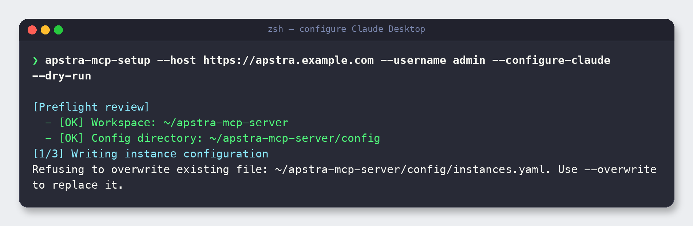

# 5. Connect an MCP client

> **Why this step:** The server is useless on its own — it waits for a client to call its
> tools. This section wires it into an MCP client (VS Code Copilot, Claude Desktop, Cursor,
> LM Studio, or the Gemini Antigravity IDE). Pick the one you use; the mechanics are the
> same MCP entry in a different config file.

All of these clients launch the server the same way: they run a command (`uvx --from
<repo> apstra-mcp`, or `python server.py`) with `APSTRA_CONFIG_FILE` set, and talk to it
over **stdio**.

> **Tip — let the wizard find your clients.** When run interactively, `apstra-mcp-setup`
> auto-detects installed MCP clients (Claude Desktop, Cursor, LM Studio, Antigravity) and
> offers to write the server entry into each one at its default config path. The manual
> steps below are for reference or for clients on non-default locations.


---

## 5.1 VS Code (GitHub Copilot)

The setup wizard already wrote `.vscode/mcp.json` for you (see
[Section 4.4](04-configure.md#vscodemcpjson)). To use it:

1. Open the repository folder in VS Code.
2. Open the **Copilot Chat** view and switch to **Agent** mode.
3. VS Code detects `.vscode/mcp.json` and offers to start the `apstra` server. Start it.
4. The `apstra` tools now appear in the tool picker.

To wire it up in a *different* workspace, copy the `servers.apstra` block from
`.vscode/mcp.json` into that workspace's own `.vscode/mcp.json`, fixing the `--from` path
and `APSTRA_CONFIG_FILE` to point at your clone.

---

## 5.2 Claude Desktop

Let the wizard write Claude's config for you by adding `--configure-claude`. It's smart
about not clobbering existing files — here's a dry run against a workspace that already
has an `instances.yaml`:

```bash
apstra-mcp-setup \
  --host https://apstra.example.com \
  --username admin \
  --configure-claude --dry-run
```



Two things to notice:

- Adding `--configure-claude` turns the plan into **three** steps (`[1/3]`,`[2/3]`,`[3/3]`)
  — instances YAML, VS Code config, **and** Claude Desktop config.
- The wizard **refuses to overwrite** an existing `config/instances.yaml` unless you pass
  `--overwrite`. This guard protects the file that holds your credentials.

To actually write Claude's config, drop `--dry-run` (and add `--overwrite` only if you
intend to replace an existing instances file):

```bash
apstra-mcp-setup --host https://apstra.example.com --username admin --configure-claude
```

The wizard edits Claude Desktop's `claude_desktop_config.json` (override the location with
`--claude-config-path`). **Restart Claude Desktop** afterwards so it reloads MCP servers.

The entry it writes is equivalent to:

```json
{
  "mcpServers": {
    "apstra": {
      "command": "uvx",
      "args": ["--from", "~/apstra-mcp-server", "apstra-mcp"],
      "env": {
        "APSTRA_CONFIG_FILE": "~/apstra-mcp-server/config/instances.yaml"
      }
    }
  }
}
```

---

## 5.3 Cursor, LM Studio, and Antigravity

These clients all use the **same `mcpServers` shape** as Claude Desktop — only the file
location differs. The setup wizard can write any of them with a flag
(`--configure-cursor`, `--configure-lmstudio`, `--configure-antigravity`), or auto-detect
them interactively. Default config locations:

| Client      | Default config path                  |
| ----------- | ------------------------------------ |
| Cursor      | `~/.cursor/mcp.json`                 |
| LM Studio   | `~/.lmstudio/mcp.json` (v0.3.17+)    |
| Antigravity | `~/.gemini/config/mcp_config.json`   |

Add this entry (adjusting the paths) to whichever file applies:

```json
{
  "mcpServers": {
    "apstra": {
      "command": "uvx",
      "args": ["--from", "/absolute/path/to/apstra-mcp-server", "apstra-mcp"],
      "env": {
        "APSTRA_CONFIG_FILE": "/absolute/path/to/apstra-mcp-server/config/instances.yaml"
      }
    }
  }
}
```

Prefer an activated venv over `uvx`? Swap the command:

```json
{
  "command": "/absolute/path/to/apstra-mcp-server/.venv/bin/python",
  "args": ["/absolute/path/to/apstra-mcp-server/server.py"]
}
```

Restart the client after editing so it reloads MCP servers.

> **Ollama is not an MCP host.** Ollama is a model runtime and does not read an MCP config
> file to consume this server. Its role in this project is the optional **RAG embedding
> provider** (see [Section 8](08-configuration-reference.md)), not an MCP client. To use an
> Ollama-served model with these tools, run it through an MCP host such as LM Studio and
> point that host at the server as shown above.

---


## 5.4 Verify the connection

Once the client starts the server, ask it something simple like *"list the Apstra tools
you have"* or *"list blueprints"*. If tools are missing, jump to
[Troubleshooting](09-troubleshooting.md).

---

**Next:** [6. Validate & run →](06-validate-and-run.md)
