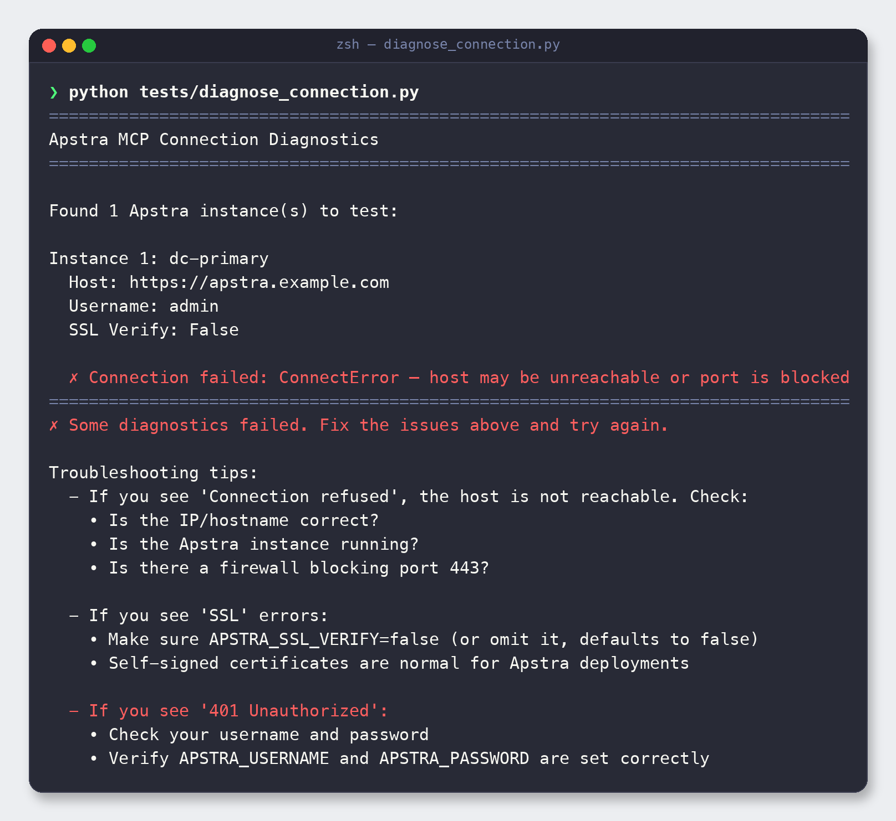
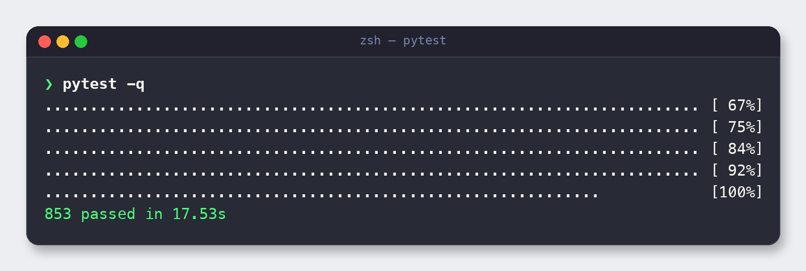
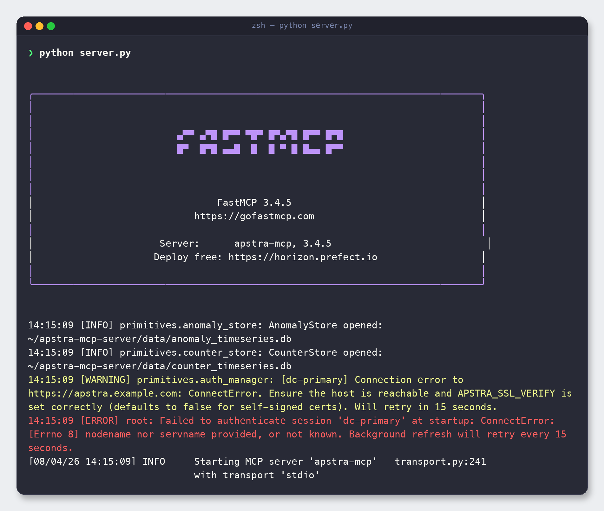

# 6. Validate & run

> **Why validate before connecting a client?** If the server can't reach Apstra or can't
> even start, your AI client will just show empty or failing tools with no explanation.
> Two commands here tell you exactly where you stand.

---

## 6.1 Test connectivity with the diagnostics script

Before starting the server, confirm it can actually reach your controller and
authenticate. The bundled diagnostics script reads your `instances.yaml`, tries each
instance, and prints targeted troubleshooting tips on failure:

```bash
python tests/diagnose_connection.py
```



The screenshot above is deliberately pointed at a placeholder host, so it shows the
**failure** path — `Connection failed: ConnectError` — followed by the built-in
troubleshooting checklist (reachability, SSL, and 401 auth). Against a real, reachable
controller you'll instead see a success line for each instance.

Use this checklist to interpret the result:

- **`ConnectError` / `Connection refused`** → the host is wrong, down, or a firewall is
  blocking port 443.
- **SSL errors** → set `ssl_verify: false` (the default) for self-signed lab certs.
- **`401 Unauthorized`** → username or password is wrong.

Every one of these maps to a fix in [Troubleshooting](09-troubleshooting.md).

---

## 6.2 Run the test suite (optional but reassuring)

The project ships a large, **mock-based** test suite — it runs fully offline and doesn't
touch a real controller. Running it confirms your install is healthy:

```bash
pytest -q
```



You should see **853 passed**.

> **If collection fails:** A few modules need a live controller or an optional extra
> (for example `tests/auth_test.py` and `tests/test_chunker.py`). If you see collection
> errors from those, exclude them:
>
> ```bash
> pytest -q \
>   --ignore=tests/auth_test.py \
>   --ignore=tests/test_chunker.py \
>   --ignore=tests/qa_live.py \
>   --ignore=tests/qa_backfill.py \
>   --ignore=tests/diagnose_connection.py \
>   --ignore=tests/test_diagnose_connection.py
> ```

---

## 6.3 Start the server

Now run it. Any of these three are equivalent:

```bash
python server.py               # direct
apstra-mcp                     # console entry point (venv)
uvx --from . apstra-mcp        # ephemeral env via uv
```



Read the startup log top to bottom — it tells a story:

- The **FastMCP banner** confirms the framework version and that the server is booting.
- **AnomalyStore / CounterStore opened** — the local SQLite trend stores initialised.
- An **auth attempt** runs immediately. Against the placeholder host it logs a `WARNING`
  then an `ERROR` (`Failed to authenticate`) — expected here. Crucially, the server does
  **not** crash: it keeps retrying auth in the background so a temporarily unreachable
  controller doesn't take the server down.
- **`Starting MCP server 'apstra-mcp' with transport 'stdio'`** — it's up and listening.

> When launched by an MCP client, the client manages this process for you over stdio — you
> won't run `python server.py` by hand in day-to-day use. Run it manually only to verify
> startup and read the logs.

---

## 6.4 Confirm background data collection

Starting the server also starts two **background pollers** that continuously extract data
from Apstra into local SQLite stores under `data/`, feeding the historical/trend tools:

- **Anomaly timeline poller** — backfills ~30 days of anomaly history, then samples every
  ~60 seconds into `data/anomaly_timeseries.db`.
- **Interface counter poller** — samples interface counters every ~5 minutes into
  `data/counter_timeseries.db`.

They only run while the server is running. Leave it running for a few minutes (the anomaly
backfill and the first counter sample need time), then verify collection is healthy:

```bash
python tests/verify_data_collection.py
```

The script opens both stores read-only and reports, per blueprint/instance, whether data
is present and **recent**. It exits non-zero if a store is missing/empty or the newest
sample is older than the freshness window — handy as a setup smoke check or in CI:

```bash
python tests/verify_data_collection.py --max-age-minutes 15   # freshness window
python tests/verify_data_collection.py --json                 # machine-readable
```

If it reports "not healthy", the usual causes are: the server was only just started (wait
a few minutes and rerun), the server is not running, or it cannot authenticate to Apstra
(rerun the diagnostics in [Section 6.1](#61-test-connectivity-with-the-diagnostics-script)).

---

## 6.5 Choosing a transport

The server defaults to **stdio**, which is what desktop MCP clients expect. You can switch
transports with environment variables:

| Transport | How to start | Use it for |
|-----------|--------------|------------|
| `stdio` (default) | `python server.py` | Local clients (VS Code, Claude, Cursor). |
| `http` | `MCP_TRANSPORT=http MCP_PORT=8080 python server.py` | Remote/networked clients; a shared server. |
| `sse` | `MCP_TRANSPORT=sse MCP_PORT=8080 python server.py` | Clients that use server-sent events. |

For HTTP/SSE you can also set `MCP_HOST` (bind address). See all runtime variables in the
[Configuration reference](08-configuration-reference.md#82-server-runtime-variables).

---

## 6.6 Turning up the logs

If something's off, raise verbosity:

```bash
MCP_VERBOSE=2 python server.py
```

`0` is quiet (default), `1` adds informational logs, `2` is full debug — useful when
diagnosing auth or graph-cache issues.

---

**Next:** [7. Tool reference →](07-tools-reference.md)
