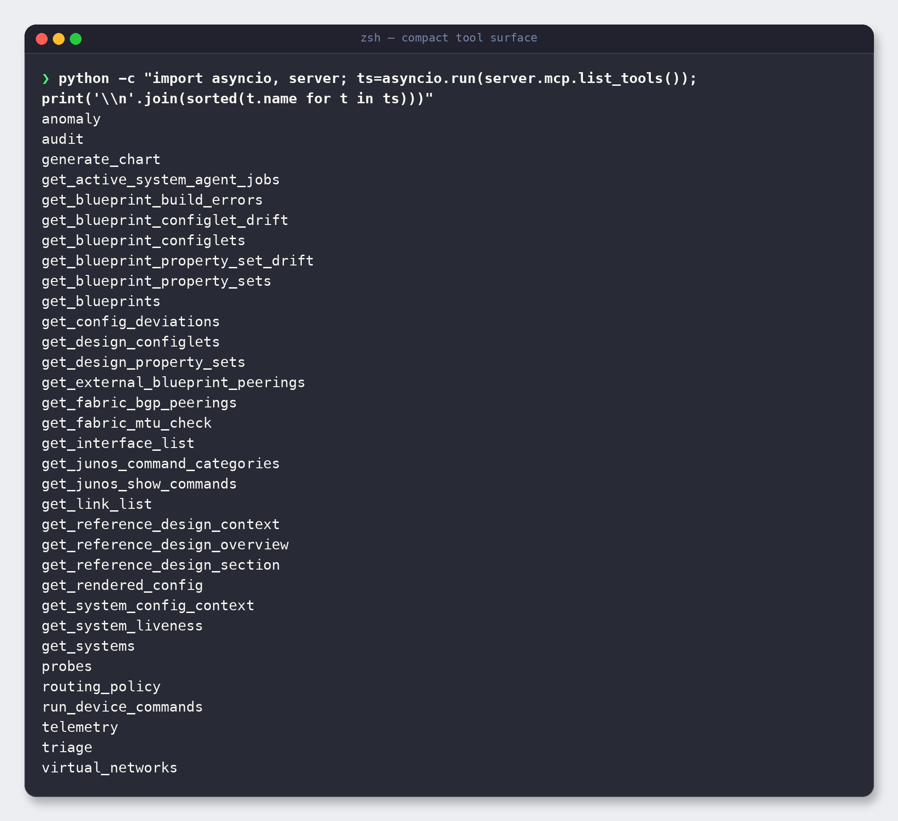
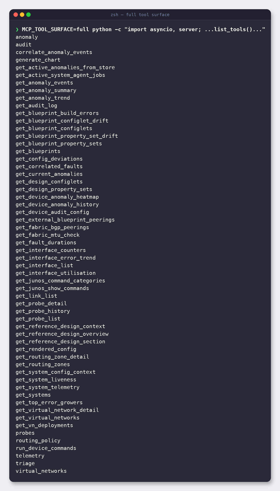

# 7. Tool reference

> **Why two "surfaces"?** LLMs work better with fewer, well-named tools. This server
> ships a **compact** surface (33 tools) by default — with smart *umbrella* tools that
> route to many operations — and an optional **full** surface (58 tools) that also exposes
> every granular operation directly, for power users and automation.

Switch surfaces with one environment variable:

```bash
# Default: 33 tools
python server.py

# Everything: 58 tools
MCP_TOOL_SURFACE=full python server.py
```

You can list the exact tools your server exposes at any time:

```bash
python -c "import asyncio, server; ts=asyncio.run(server.mcp.list_tools()); print('\n'.join(sorted(t.name for t in ts)))"
```

---

## 7.1 The compact surface (default — 33 tools)



Here they are grouped by what you'd use them for, with an example prompt you could type to
your AI client.

### Blueprints & commit health

| Tool | What it answers | Example prompt |
|------|-----------------|----------------|
| `get_blueprints` | Which blueprints exist? | *"List all Apstra blueprints."* |
| `get_blueprint_build_errors` | What's blocking my commit? | *"Why can't I commit the DC1 blueprint?"* |
| `get_blueprint_configlets` | What configlets are applied? | *"Show configlets on blueprint DC1."* |
| `get_blueprint_property_sets` | What property sets are in use? | *"List property sets used by DC1."* |
| `get_blueprint_configlet_drift` | Have applied configlets drifted from the catalog? | *"Has any configlet drifted in DC1?"* |
| `get_blueprint_property_set_drift` | Have property sets drifted? | *"Check property-set drift on DC1."* |
| `get_config_deviations` | Where does device config differ from intent? | *"Show config deviations in DC1."* |

### Topology & inventory

| Tool | What it answers | Example prompt |
|------|-----------------|----------------|
| `get_systems` | What devices are in the fabric? | *"List systems in DC1 with their roles."* |
| `get_system_liveness` | Which devices are up/down? | *"Which devices in DC1 are down?"* |
| `get_interface_list` | What interfaces exist? | *"List interfaces on leaf1 in DC1."* |
| `get_link_list` | How is the fabric cabled? | *"Show the links between spines and leaves in DC1."* |
| `get_fabric_bgp_peerings` | What's the BGP fabric underlay/overlay? | *"Show BGP peerings in DC1."* |
| `get_external_blueprint_peerings` | What are my external/DCI peerings? | *"List external peerings for DC1."* |
| `get_active_system_agent_jobs` | Any device agent jobs running? | *"Are there active agent jobs in DC1?"* |
| `get_fabric_mtu_check` | Any MTU mismatches across links? | *"Check fabric MTU consistency in DC1."* |

### Virtual networks & routing

| Tool | What it does | Example prompt |
|------|--------------|----------------|
| `virtual_networks` | Umbrella: list VNs, VN detail, VN deployments, routing zones | *"List virtual networks in DC1 and show VN web-tier's detail."* |
| `routing_policy` | Inspect routing policies / routing-zone policy intent | *"Show the routing policy for zone prod in DC1."* |

### Device config & JunOS

| Tool | What it does | Example prompt |
|------|--------------|----------------|
| `get_rendered_config` | The full rendered config for a device | *"Show the rendered config for leaf1 in DC1."* |
| `get_system_config_context` | The config context/intent for a device | *"What's the config context for leaf1?"* |
| `run_device_commands` | Run JunOS `show` commands via Apstra | *"Run 'show bgp summary' on leaf1 in DC1."* |
| `get_junos_command_categories` | Browse the JunOS `show` command catalog | *"What JunOS command categories are available?"* |
| `get_junos_show_commands` | Look up specific `show` commands | *"Which show commands cover BGP?"* |

### Anomalies & triage

| Tool | What it does | Example prompt |
|------|--------------|----------------|
| `anomaly` | Umbrella: current anomalies, summaries, trends, timeline, per-device history | *"Summarise active anomalies in DC1 and the 7-day trend."* |
| `triage` | Umbrella: correlate faults, fault durations, top error growers | *"Triage DC1 — what faults correlate and which are worst?"* |

### Telemetry & probes

| Tool | What it does | Example prompt |
|------|--------------|----------------|
| `telemetry` | Umbrella: interface counters, utilisation, error trends, system telemetry | *"Show interface utilisation and error trends for leaf1."* |
| `probes` | Umbrella: list IBA probes, probe detail, probe history | *"List IBA probes in DC1 and show the details of the ECMP imbalance probe."* |

### Audit & catalog

| Tool | What it does | Example prompt |
|------|--------------|----------------|
| `audit` | Umbrella: audit log, per-device audit config | *"Show the recent audit log for DC1."* |
| `get_design_configlets` | Configlets in the global design catalog | *"List catalog configlets."* |
| `get_design_property_sets` | Property sets in the global design catalog | *"List catalog property sets."* |

### Reference material & charts

| Tool | What it does | Example prompt |
|------|--------------|----------------|
| `get_reference_design_overview` | High-level Apstra reference design guide | *"Give me an overview of the Apstra reference design."* |
| `get_reference_design_section` | A specific section of the reference guide | *"Show the reference-design section on 5-stage Clos."* |
| `get_reference_design_context` | Reference context relevant to a question | *"What does the reference design say about border leaves?"* |
| `generate_chart` | Render a PNG chart of a trend | *"Chart the anomaly count for DC1 over the last 30 days."* |

---

## 7.2 The full surface (`MCP_TOOL_SURFACE=full` — 58 tools)

The full surface keeps the umbrella tools **and** exposes the 25 granular operations they
dispatch to, so a client (or a script) can call exactly one operation directly:



The extra 25 tools map onto the umbrellas like this:

| Umbrella (compact) | Granular tools it wraps (exposed in full) |
|--------------------|-------------------------------------------|
| `anomaly` | `get_current_anomalies`, `get_active_anomalies_from_store`, `get_anomaly_summary`, `get_anomaly_events`, `get_anomaly_trend`, `get_device_anomaly_history`, `get_device_anomaly_heatmap`, `correlate_anomaly_events` |
| `triage` | `get_correlated_faults`, `get_fault_durations`, `get_top_error_growers` |
| `telemetry` | `get_interface_counters`, `get_interface_utilisation`, `get_interface_error_trend`, `get_system_telemetry` |
| `probes` | `get_probe_list`, `get_probe_detail`, `get_probe_history` |
| `audit` | `get_audit_log`, `get_device_audit_config` |
| `virtual_networks` | `get_virtual_networks`, `get_virtual_network_detail`, `get_vn_deployments` |
| `routing_policy` | `get_routing_zones`, `get_routing_zone_detail` |

### Which surface should I use?

| Use... | When... |
|--------|---------|
| **compact** (default) | You're driving the server from a chat client. Fewer tools = better tool selection by the model, with the umbrellas covering the detail. |
| **full** | You're scripting against specific operations, debugging one exact call, or your workflow benefits from the model seeing every granular tool. |

---

**Next:** [8. Configuration reference →](08-configuration-reference.md)
